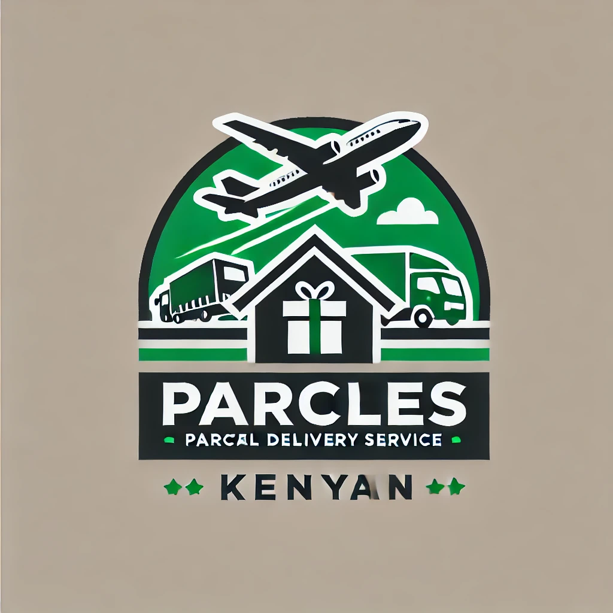
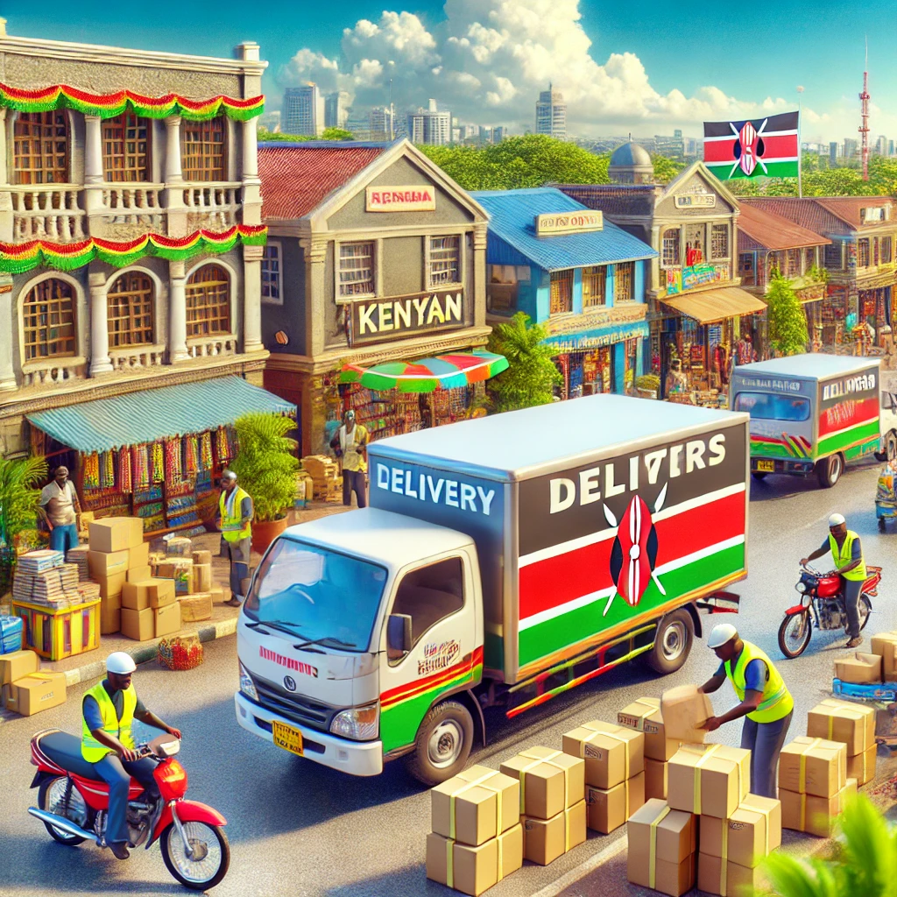

# Matwana Logistics Parcel Tracking System

<video controls src="src/assets/vid.mp4" title="Title"></video>

# Overview
The Matwana Logistics Parcel Tracking System is a web-based platform that allows users to efficiently manage and track parcels in real-time. The system includes features like requesting parcel quotes, managing parcel deliveries, and monitoring parcel status updates. It is built using React (frontend), Vite (build tool), and a backend API for managing parcel data.

## Features
1.Parcel Quote System: Users can get a quick quote based on parcel weight, destination, and origin.
2.User Authentication: Secure login and sign-up system for users.
3.Real-Time Parcel Tracking: Track parcels in real-time as they move through different stages of delivery.
4.Responsive Design: Optimized for both desktop and mobile devices.

# Technologies Used
1.Frontend: React, Vite
2.Backend: Flask (or any other server)
3.Styling: CSS
4.State Management: React Hooks, Context API
5.Package Manager: npm

# Installation and Setup
# Prerequisites
1.Node.js (>=14.x)

2.npm (>=6.x)

3.A backend API for managing parcels (Flask or another backend framework)

# Steps
1.Clone the Repository

2.Install Dependencies
npm install

Run the Development Server
npm run dev

3.Build the Project If you want to generate a production build:
npm run build

4.Run the Backend API (if applicable) If you’re using Flask for the backend, navigate to your backend folder and start the Flask server:
flask run

5.Open the Application Open your browser and navigate to:
http://localhost:5173

# Project Structure
├── src
│   ├── assets             # Images, icons, and other assets
│   ├── components         # React components (Navbar, HomePage, GetQuote, etc.)
│   ├── styles             # CSS styles for components
│   ├── App.jsx            # Main app file
│   ├── main.jsx          # Entry point
│   └── ...
├── public                 # Public folder for static files
├── package.json          # Project documentation
├── README.md         # npm configuration
└── vite.config.js         # Vite configuration

# Key Components
Navbar: Contains links for navigation such as Home, Login, and Signup.
HomePage: Displays the main landing page with image transitions, a welcome message, and the quote form.
GetQuote: A form for entering parcel details (origin, destination, weight) and getting an instant quote.
Footer: Contains copyright and additional links.